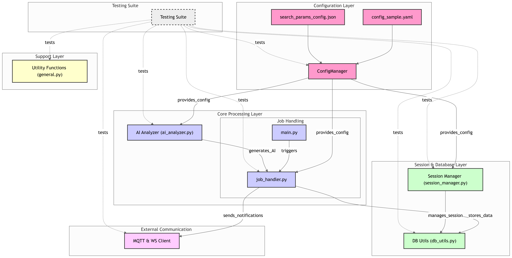

# BOSS直聘自动投简历
> 仅供Python爱好者，交流学习

### 其他同类项目
- [yangfeng20/boss_batch_push](https://github.com/yangfeng20/boss_batch_push) 油猴脚本
- [loks666/get_jobs](https://github.com/loks666/get_jobs) Java项目，多平台
- [lastsunday/job-hunting](https://github.com/lastsunday/job-hunting) 浏览器插件，多平台
- [Ocyss/boos-helper](https://github.com/Ocyss/boos-helper) 浏览器插件
- [IceyOrange/AutoBOSS](https://github.com/IceyOrange/AutoBOSS)  Python项目 
- [rebibabo/Job-Hunting-Agent](https://github.com/rebibabo/Job-Hunting-Agent) Python项目

本项目fork自 [SanThousand/auto_get_jobs](https://github.com/SanThousand/auto_get_jobs)
## 项目简介
> 请查看 **[原项目](https://github.com/SanThousand/auto_get_jobs)**

## 使用说明
详细教程请点击 [详细部署教程](docs/部署指南.md)  
初次使用，复制`data`目录下的`config.yaml.sample`，重命名为`config.yaml`后进行修改，其余步骤参考原项目

可以使用以下插件 [SQLite Viewer](https://marketplace.visualstudio.com/items?itemName=qwtel.sqlite-viewer) 查看保存的数据库`jobs.db`

---
目前仍在开发，部分功能可能不可用

如果你在使用过程中遇到bug，请提交反馈

如果你喜欢PYTHON，且愿意为本项目做贡献。欢迎PR

交流群 `487194990`

---
#### 项目计划

---
**已完成**
- 原项目实现
  - [x] 自动过滤不活跃的HR
  - [x] 学历、城市、薪资、岗位筛选
  - [x] AI岗位匹配度分析
  - [x] 自动打招呼（BOSS内默认设置）
- [x] 使用`config.yaml`作为配置文件
- [x] 岗位搜索参数细分
  - 避免地区岗位过多显示不全
- [x] 使用sqlite数据库保存数据
  - sqlite更轻量,mysql需要额外配置
- [x] 查询数据库数据，避免重复投递
- [x] 用户简历和用户岗位需求独立配置
- [x] AI生成打招呼语，发送自定义招呼语
- [x] 发送图片简历
- [x] 初步实现了MQTT客户端
  - 除发送打招呼语，以及图片简历外，理论可以实现更多功能
- [x] playwright框架替代selenium框架，以优化岗位查询体验
- [x] 从数据库导出excel，pdf生成图片
  - `tests`目录包含脚本
- [x] 完善一下文档
  - 逐步完善中

**计划中** (按优先级排序)
- [ ] 使用qt创建一个图形化界面
- [ ] 优化一下导出的excel的格式
- [ ] 使用重试队列，解决MQTT客户端会漏消息的问题
- [ ] 支持pdf发送简历
  - 即自动将pdf转成图片后再发送
- [ ] 对于同一公司的相似岗位，不重复投递
- [ ] 响应hr简历请求
- [ ] 将现有的工作详情查询和岗位沟通的接口操作改成playwright的模拟操作
- [ ] 令牌桶管理所有与boss直聘通信的http请求
  - 把请求塞到playwright里，然后通过playwright提供的route方法拿令牌桶限速
- [ ] 到达投递上限后自动切号
- [ ] 让ai生成搜索关键词，扩展可接受岗位
- [ ] 数据库数据共享
- [ ] 识别公司是不是外包，查询社保人数等

#### 项目当前架构图

Power by [ahmedkhaleel2004/gitdiagram](https://github.com/ahmedkhaleel2004/gitdiagram)

## LICENSE
[GNU General Public License v3.0](./LICENSE)