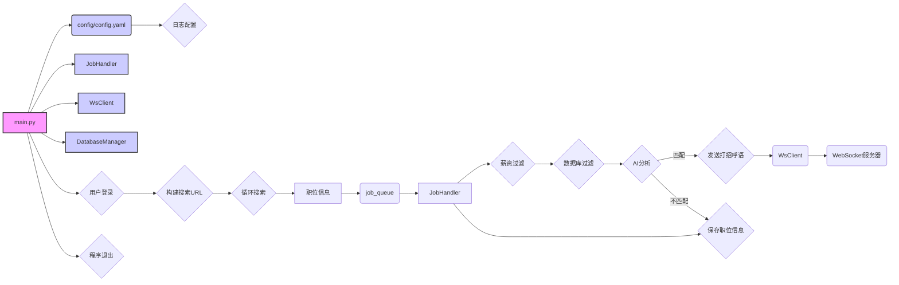

# 开发者文档

## 数据流图

## 流程说明

1.  **程序启动**: `main.py` 作为程序入口，加载 `config/config.yaml` 配置文件。
2.  **日志配置**: 根据配置文件配置日志系统。
3.  **初始化**: 初始化 `JobHandler`, `WsClient`, `DatabaseManager` 等组件。
4.  **用户登录**: 使用 Playwright 模拟用户登录 BOSS 直聘网站。
5.  **构建搜索 URL**: 根据配置文件中的 `job_search` 参数，构建搜索 URL 列表。
6.  **循环搜索**: 循环遍历搜索 URL 列表，访问每个 URL，获取职位信息。
7.  **职位信息处理**:
    *   将获取到的职位信息放入 `job_queue` 队列。
    *   `JobHandler` 从 `job_queue` 队列中取出职位信息。
    *   根据配置的 `salary_range` 过滤职位。
    *   从数据库中过滤掉已经访问过的职位。
    *   使用 AI 分析职位是否匹配。
    *   如果匹配，则发送打招呼语（如果启用 AI 打招呼语）。
    *   将职位信息保存到数据库。
8.  **WebSocket 通信**: `WsClient` 负责与 WebSocket 服务器通信，发送打招呼语等消息。
9.  **程序退出**: 接收到停止信号后，程序退出。
