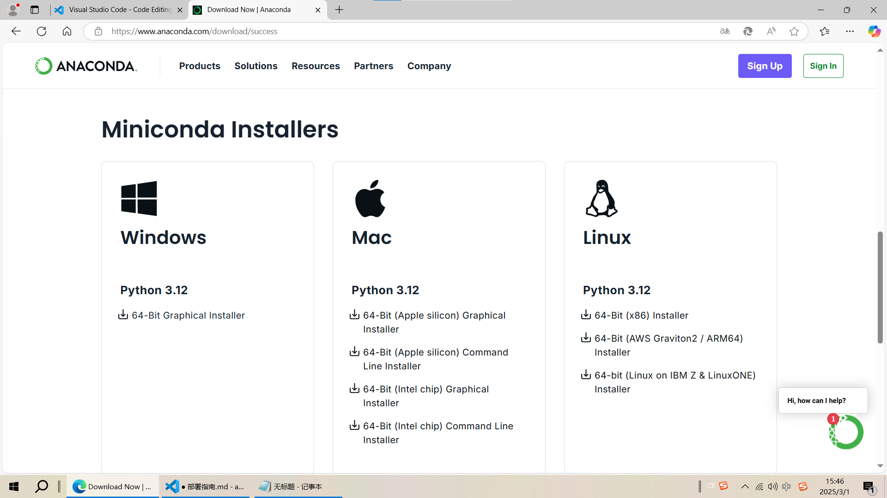
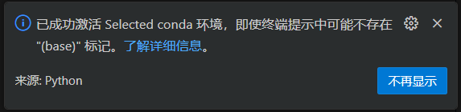

# 使用指南 (Windows环境)

## 环境准备

### 1. 安装 Visual Studio Code
- 下载地址：[VSCode 官方下载](https://code.visualstudio.com/)

### 2. 安装 Miniconda
- 下载地址：[Miniconda 下载页](https://www.anaconda.com/download/success)
- 安装注意事项：
  - 往下滑选择 Miniconda 版本 


### 3. 安装 Git
- 下载地址：[Git Windows版](https://git-scm.com/downloads/win)
- 安装建议：
  - 使用默认选项即可
  - 重要组件选择：
    - Git Bash Here（推荐）
    - Git GUI Here
  - 行尾转换选择 "Checkout as-is, commit Unix-style line endings"


---

## 项目配置

### 1. 克隆项目仓库
在桌面或者任意文件夹内，按住`shift+鼠标右键`，点击`在此处打开Powershell`，然后粘贴下面命令
```bash
git clone https://github.com/Ynkcc/auto_get_jobs
```
### 2. 使用Visual Studio Code打开项目
1. 在VSCode中打开项目文件夹
2. 导航至 `src/main.py`，并安装弹出的提示中推荐的插件
3. 点击左上角的`查看(V)`，然后点击`终端`
4. 如果你的conda安装正确，将出现以下提示

### 3. 安装依赖包
在终端，命令窗口中输入以下命令  
```bash
pip install -r requirements.txt -i https://pypi.tuna.tsinghua.edu.cn/simple
```
---

### 4. 复制并修改配置文件
1. 将`config`目录下的`config_sample.yaml`复制一份，并重命名为`config.yaml`后进行修改
2. 修改同目录的`resume_for_ai.md`文件

### 5. 配置浏览器驱动，并运行项目
1. 请参考driver目录下的 `webdriver配置指南.md`  
2. 导航至 `src/main.py`
3. 点击右上角的 ▷ 运行按钮

> 更多问题请加群提问或提交Issue  
交流群 `487194990`
